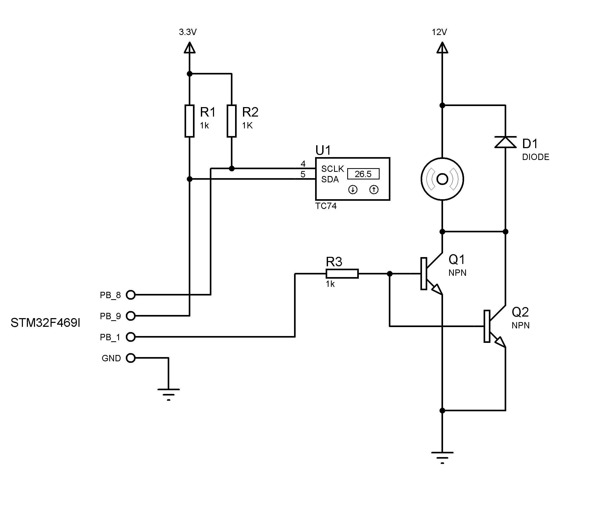
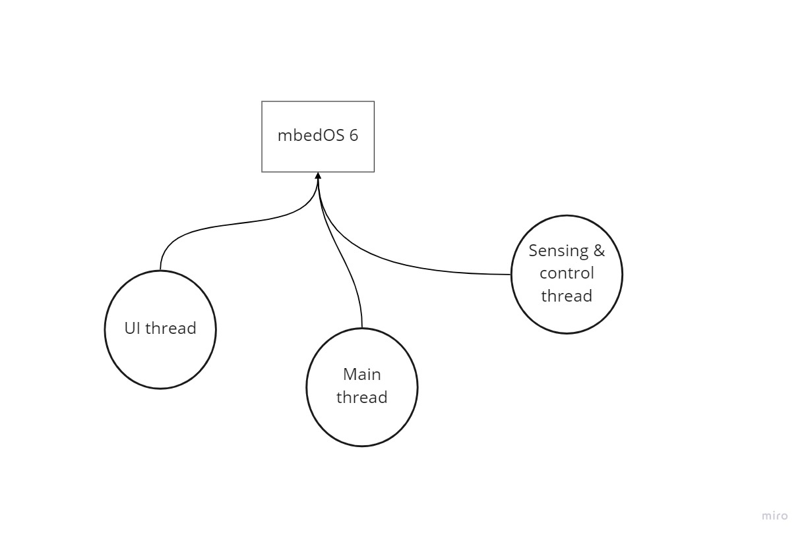

#### Please note that commits with username "EyitopeIO" and "adelowoe" refer to the same individual

## 1 - Embedded System Proposal
The system described by this repository is a temperature driven motor controller which is to be configurable by touch. The relationship between motor speed and temperature may be defined by a transfer function, derived from heat equations, or just a linear function.

For the purpose of this project, a linear mapping/ranging is used to convert a temperature range to the appropriate duty cycle to drive the motor.

**The ranges used for mapping are hardcoded.**
The lowest and highest temperature permitted: 16 and 37 deg. celcius respectively.
The lowest and highest duty cycle for the motor: 0 and 100 percent.

The motor was driven at a constant 120Hz PWM frequency. Speed was varied by adjusting the duty cycle.

## 2 - Hardware Design

Please find information about the STM32- pins used above [here](https://os.mbed.com/platforms/ST-Discovery-F469NI/).
The temperature sensor datasheet can be found [here](https://www.microchip.com/en-us/product/TC74)

#### Component list
* 1 × STM32F469I
* 1 × Microchip TC74 tempereature sensor
* 1 × Brushed DC motor
* 2 × NPN transistor 
* 3 × 1k resistors

## 3 - Embedded Code Implementation and Architecture

### Threads
#### UI thread
This is where the TouchGFX library sits to update the display at 60Hz. TouchGFX provides a `tick()` function where user tasks can be executed between frame updates, but this is not sufficient to meet the PWM frequency. Though the library claims to be independent of OS, efforts to use this with MbedOS 6 proved futile; though it successfully ran on FreeRTOS. See video below.

As the focus was to develop this using MbedOS 6, development did not continue with FreeRTOS.

#### Sense and control thread
This thead reads the temperature sensor and adjusts the duty cycle of the PWM signal to the motor every 3s. One will observe in the code that a linear equation converts the temperature to the duty cycle. One will also observe that this approach consequently means abrupt changes in motor PWM signal as temperature changes.

This can be mitigated by using an exponential function between period changes but it is not implemented here. Definitions for such a process or any other implementation should go into the `temperature_to_dutycc()` function.

#### Main thread
This is the application main loop. It does nothing than to blink the green LED on the board at a regular interval.

### Classes
The temperature sensor was represented in code by being an object of a class that inherits from the `I2C` class of MbedOS. Similar approach was taken for the motor which is dependent on `PWM` class. Both objects are statically allocated. See **Source files** below.

### Important source files and folders
1. tc74.hpp & tc74.cpp
2. motor.hpp & motor.cpp
3. mainSTM.c
4. <top_level_directory>/lib/touchgfx

(1) are definitions for the temperature sensor.

(2) are definitions for the DC motor.

(3) contained the `main()` function (now `mainSTM()`) originally defined to run on FreeRTOS. It has been renamed to avoid name conflicts. A C program can of course only have one definition of `main()`.

(4) contains the source code definitions for the GUI in the demo video with FreeRTOS.

### Power saving
MbedOS 6 has two ways to bring a delay to effect
1. Busy wait
2. Going to sleep mode

`wait_us()` is to busy wait and `thread::sleep_for()` is to sleep mode. Of course, the later was used. The only part of the code that needs no delay is the UI thead as the TouchGFX library is built for a target frame rate of 60Hz.

## 4 - Evaluation
The basic functionality of the system which is to vary the speed of DC motor according to the temperature has been achieved; however, bringing the UI to life on MbedOS proved difficult to debug. 

The MbedOS returned a **Hardware fault MbedOS Error Status: 0x80FF013D Code: 317 Module: 255**. Using the onboard debugger on the STM32F469I discovery board, the error seems to occur when the DMA is initialized. Limited development time will not permit complete analysis of the entire debug information made available by the debugger i.e. all registers, stack pointer, program counter, etc.

Since the UI runs in a separate thread, it can be it canbe readily incoorporated when bug has been fixed. An example hard fault can be found [Here](https://community.st.com/s/question/0D53W00000557ZoSAI/hardfault-with-touchgfx-)
